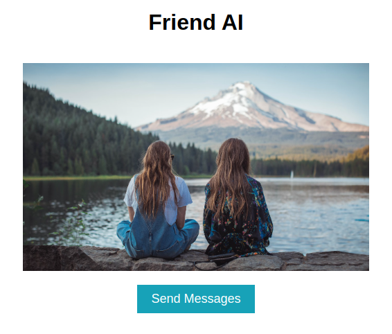
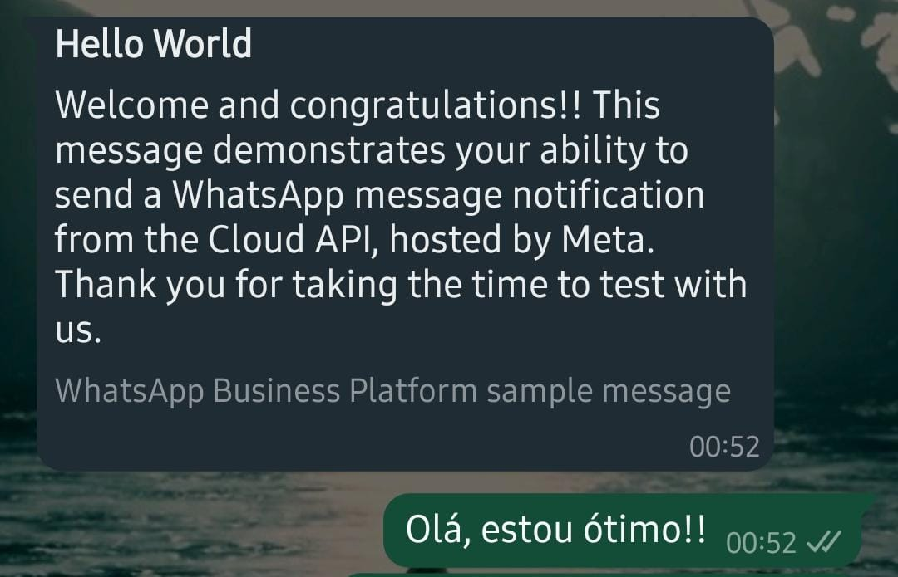
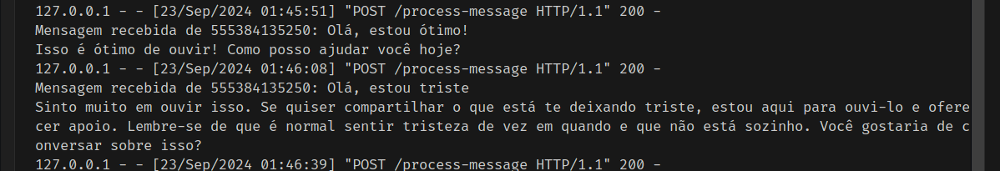

# This project is a test for an open role opportunity at InfusionAI

<div style="display: flex; justify-content: space-between;">
  
  
</div>


Friend AI is a Python-based application that integrates with the WhatsApp Business API to send and receive messages using OpenAI's GPT model. This project aims to create an interactive experience by allowing users to communicate with an AI friend via WhatsApp.

## Features

- Send text messages to users via WhatsApp.
- Receive and process incoming messages from users.
- Utilize OpenAI's GPT model to generate responses.

## Technologies Used

- Python
- Flask
- Aiohttp
- OpenAI API
- WhatsApp Business API
- Docker

## Technologies to be implemented
- Pulumi
- AWS Lambda
- AWS SQS

### Installation

1. Clone the repository:

   ```bash
   git clone https://github.com/feduarte-dev/infusionai-test.git
   cd infusionai-test
   

2. Build the Docker image:

   ```bash
   docker build -t infusionai .
   ```

3. Run the Docker container:

   ```bash
   docker run -p 5000:5000 infusionai
   ```

### Configuration

1. Check .env.example to update the enviroment variables.

2. I have to be with Ngrok active in my account in order to get the link online

3. I have to generate again a temporary access token for Whatsapp API

PS: You probably wont open this in your machine, actually, this is just a self reminder for what I have to do to run this project.

### Usage

On the webpage, you can click to send a template message to each registered user. When a user replies to the message, the AI will process their response and generate a tailored reply to send back.

### Logging

To view logs and print statements while the application is running in Docker, use the following command:

```bash
docker logs -f <container_name_or_id>
```

### Bugs
1. Sometimes the order of the responses gets mixed up and appears out of sequence. I believe that using a queue logic could resolve this issue.


### To do

1. At this moment, I can only send template messages; custom messages must undergo a review process. Therefore, I am unable to send a custom reply back.

2. Add login and user authentication

3. Try to make AI remember user conversation history


## Acknowledgments

- [OpenAI](https://openai.com/)
- [WhatsApp Business API Documentation](https://developers.facebook.com/docs/whatsapp)
